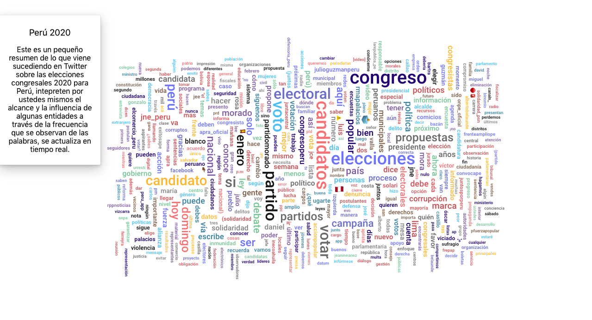

# Peru 2020

Peru2020 es el caso de uso de la API REST del programa Peru 2020 Scrapper que extrae tweets relacionados a las Elecciones Congresales Extraordinarias 2020 del Peru cada 30 minutos y pone los resultados a disposición de la comunidad.

https://github.com/minskylab/pe2020ru

Se ha realizado el ejemplo en el framework ReactJS, revisa el package.json para ver las dependencias y sus versiones.

Usa yarn start para visualizar y seguir trabajando el proyecto en modo dev. El proyecto se encuentra subido en con el link http://peru2020.minsky.cc/

El proyecto es de libre acceso y uso, sigan programando! 

